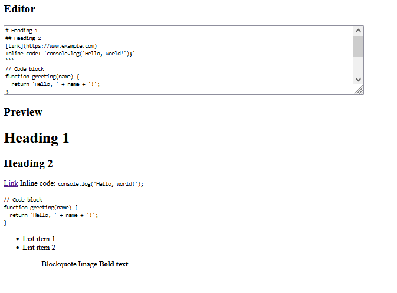

# Markdown Previewer

This is a Markdown Previewer web application built with React. It allows you to enter Markdown text and see the rendered HTML output in real-time.



## Features

- Textarea for entering Markdown text.
- Preview area that displays the rendered HTML output.
- Supports GitHub flavored Markdown.
- Default text with examples of various Markdown elements.
- Real-time updating of the preview as you type.
- Interprets carriage returns as line breaks (bonus feature).

## Technologies Used

- React: JavaScript library for building user interfaces.
- marked: A Markdown parsing library for converting Markdown to HTML.
- HTML: Markup language for creating the structure of the web page.
- CSS: Styling language for designing the appearance of the web page.
- Bootstrap: CSS framework for responsive and mobile-first web development.

## Getting Started

To run the Markdown Previewer locally, follow these steps:

1. Clone the repository:
   ```bash
   git clone https://github.com/Vkube/A_Markdown_Previewer.git
   ```
2. Navigate to the project directory:
     ```bash
   cd markdown-previewer
   ```
3. Install the dependencies:
     ```bash
   npm install
   ```
4. Start the development server:
     ```bash
   npm start
   ```
5. Start the development server:
     ```bash
   npm start
   ```
Open your web browser and visit http://localhost:3000 to see the Markdown Previewer app.

  ## Usage

    - In the editor textarea, enter your Markdown text. You can type or paste Markdown content.
    - The preview area will update in real-time to display the rendered HTML output.
    - As you continue typing or making changes to the Markdown text, the preview will update accordingly.
    - You can modify the default Markdown text provided in the editor to see different examples of Markdown elements.

  ## Credits

   - React
   - marked
   - Bootstrap
  ## License

This project is licensed under the MIT License. See the [LICENSE](https://opensource.org/license/mit/) file for details.
